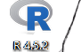
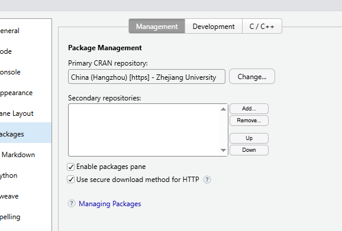
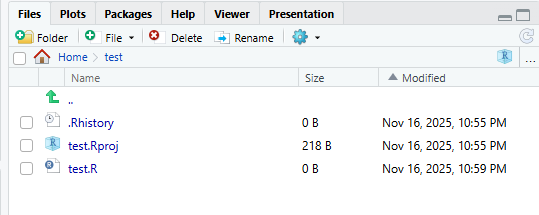
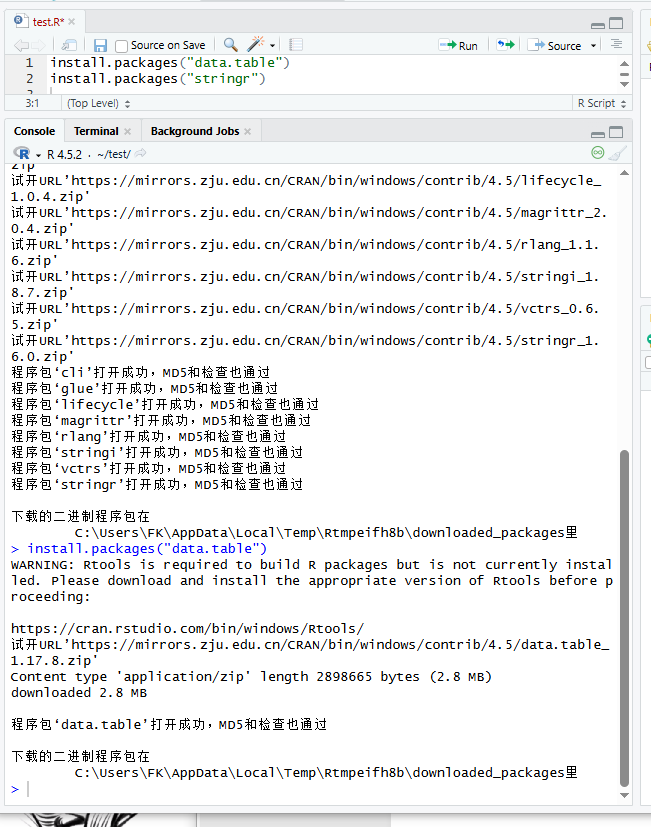
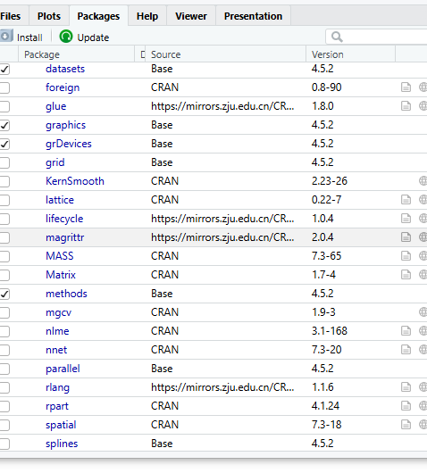
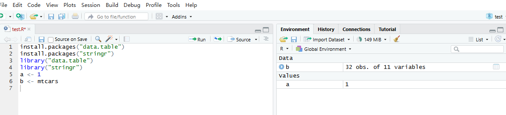

第一次作业

1.R 语言是一种专注于统计计算、数据分析和数据可视化的编程语言，具有开源、灵活且功能强大的特点，尤其在统计建模和数据处理领域有广泛应用

R 语言的起源与 S 语言密切相关。S 语言是 20 世纪 70 年代由美国贝尔实验室开发的一种统计分析语言，主要用于数据探索和统计建模。1993 年，新西兰奥克兰大学的统计学家 Ross Ihaka 和 Robert Gentleman 为了实现 S 语言的开源版本，基于 S 语言的语法和设计思想开发了 R 语言，使其成为一款免费、开源的统计计算工具，后续由 R 核心开发团队持续维护。

2.RStudio 是一款专为 R 语言设计的**集成开发环境**

R 语言是**编程语言本身**，是一套用于统计计算、数据分析的语法规则、函数库和运行环境（类似 Python 语言本身）。它能独立运行（通过自带的简易控制台），负责解析代码、执行计算逻辑。

RStudio 是**辅助工具**，本身不具备执行 R 代码的能力，而是为 R 语言提供了更友好的操作界面和功能扩展，让编写、调试、管理 R 代码的过程更高效。

3

4

5.6

第二次作业

1.run,ctrl +enter

2

3

5不需要安装，但是需要重新导入

6.7

alt+-

\<-

8#,ctrl+shift+c
